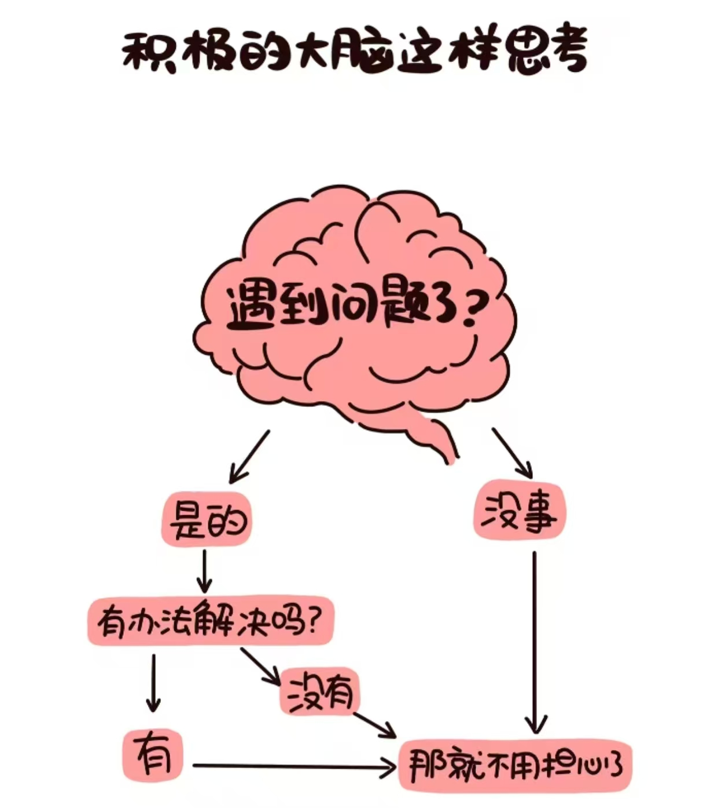

<html>
<head>
    <meta charset="UTF-8">
    Hello，我是小熊熊Adeline！
</head>
<body>
   
这是我的第一个网站，我将在这里记录学习使用AI工具的历程。

</body>
</html>

  <figure style="flex: 1; margin: 0;">
    
    <figcaption style="margin-top: 0px;">恭喜你发现一位纯血小白！</figcaption>
  </figure>
  <figure style="flex: 1; margin: 0;">
    
    <figcaption style="margin-top: 0px;"></figcaption>
  </figure>

<body>
#里程碑
    -2026.5.10 完成第一个个人Github网站quickstart。

#笔记列表
📖 [我的读书笔记](reading.md)
</body>
